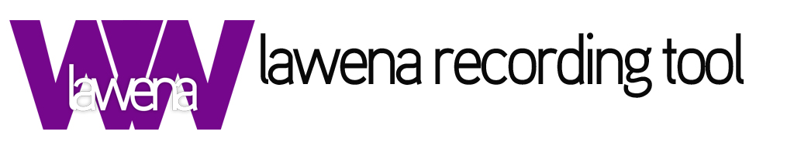

Lawena is a simple Java program that greatly enhances your TF2 and other Source games image quality for recording purposes, with little performance loss compared to other alternatives. Records using in-game **Source Recorder**, with key bindings to ease the process.

Easy to install and use. Does not interfere with your regular configs, HUD or launch options.

## Features

* Insane max quality graphics configuration
* Recorded files are saved to the directory of your choosing for comfort and order
* Options to enable/disable various game elements which may be unnecessary in the context of a movie
* Includes built-in HUDs with different levels of simplicity
* Supports custom HUDs/materials/models to add a personal touch to your movies
* Allows custom commands for extra tweaks not present in the tool
* Includes a set of built-in skyboxes, and supports custom ones via simple drag-and-drop
* [SrcDemo2](http://code.google.com/p/srcdemo2/) support to reduce drive usage and space and increase recording speed
* [VDM](https://developer.valvesoftware.com/wiki/Demo_Recording_Tools) file support for automatic movie recording process. Check the [tutorial](https://github.com/quanticc/lawena-recording-tool/wiki/VDM-tutorial)
* Creates backups in case something goes wrong
* Automatic updates

## Changes from original Lawena

* Added 64-bit TF2 support
* Tweaked some default settings
    * Resolution changed from 1280x760 to 1920x1080
    * VModelFOV changed from 70 to 90
    * Motion blur disabled
    * Crosshair enabled
    * Combat text enabled
    * Hitsounds enabled
* Added `-insecure` as default launch option
* Added some default cfg settings (thanks Phnx!)
    * `cl_jiggle_bone_framerate_cutoff 0`: fixes botkiller shaking
    * `r_portalsopenall 1`: fixes doorway flash glitch
    * `violence_agibs 1;violence_hgibs 1;violence_ablood 1;violence_hblood 1`: makes sure gibs remain enabled
    * `hud_saytext_time 0`: makes sure chat stays disabled
* Updated Java dependencies
    * com.threerings:getdown:1.6.4->1.7.1
    * net.lingala.zip4j:zip4j:1.3.2->1.3.3
    * com.github.spullara.mustache.java:compiler:0.9.5->0.9.13
    * junit:junit:4.12->4.13.2

## Building Lawena

```
git clone https://github.com/ibleedbutter/lawena-recording-tool.git
cd lawena-recording-tool.git

```

## Credits

* Original project created by Montz (currently inactive)
* Original developer: [Quantic](http://steamcommunity.com/profiles/76561198012092861/) since June 2013 to December 2018(?)
* Graphic `.cfg` files based on those made by [Chris Down's](https://chrisdown.name/tf2/) maxquality config.
* Built-in **Killnotices only** and **Medic** HUD made by [mih](https://github.com/Kuw/recordinghuds)
* Skyboxes included made by [komaokc](http://gamebanana.com/members/submissions/textures/289553) from GameBanana
* Includes some content used in PLDX recording tool
* Valve - Source engine, Team Fortress and the Team Fortress logo
